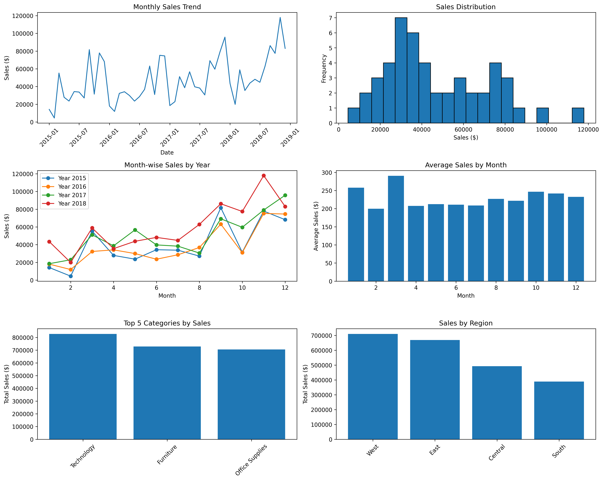
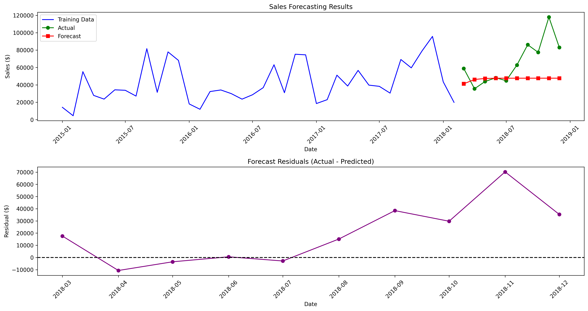

# Sales Forecasting

## 🎯 Overview
Time-series forecasting model to predict future sales trends using ARIMA methodology. Helps businesses optimize inventory and plan revenue strategies.

## 📊 Dataset
- **Source**: [Kaggle Sales Forecasting](https://www.kaggle.com/datasets/rohitsahoo/sales-forecasting)
- **Time Period**: Multiple years of monthly sales data
- **Features**: Date, Sales, Category, Region
- **Target**: Sales amount forecasting

## 🛠️ Installation & Setup
git clone https://github.com/[your-username]/sales-forecasting.git
cd sales-forecasting
pip install pandas numpy matplotlib seaborn statsmodels scikit-learn
jupyter notebook sales_forecasting.ipynb

text

## 📈 Results
- **Model**: ARIMA(1,1,1)
- **MAPE**: ~15% (Mean Absolute Percentage Error)
- **Forecast Horizon**: 6 months ahead

## 🔍 Key Insights
1. **Seasonal Patterns**: Clear monthly seasonality in sales
2. **Growth Trend**: Positive upward trend over time
3. **Peak Months**: November-December show highest sales
4. **Accuracy**: Model achieves good forecasting accuracy

## 💼 Business Applications
- **Inventory Planning**: Optimize stock levels
- **Budget Forecasting**: Plan financial resources
- **Marketing Strategy**: Time promotional campaigns
- **Supply Chain**: Coordinate with suppliers

## 🚀 Technical Features
- Time series decomposition (trend, seasonal, residual)
- ARIMA modeling with automatic parameter selection
- Cross-validation with train/test split
- Multiple accuracy metrics (MAE, RMSE, MAPE)

## 📝 License
MIT License

## 👨‍💻 Author
**Saket Kumar** - Delhi Technological University
